## Hi there

#### GitHub Stats

<!-- profile/stats.svg, profile/top-langs.svg 는 GitHub Actions가 자동 생성합니다 -->
<!-- .github/workflows/readme_stats.yml 참고 -->

---

*"디자인의 디테일과 백엔드의 견고함을 연결하는 개발자"*

 

### About Me

* **웹디자인 & 퍼블리싱** 경험을 바탕으로 **화면 흐름(UX)과 UI 디테일**을 깊이 이해합니다.
* **Front-End & Back-End** 영역을 확장하며 데이터 흐름과 API 구조를 직접 설계할 수 있는 역량을 키웠습니다.
* 프론트엔드와 백엔드 간의 **원활한 소통과 효율적인 협업**을 중요하게 생각합니다.

---

### Tech Stack

**Frontend & Design**
* NestJs, React, JavaScript, TypeScript, HTML5/CSS3
* Figma, Web Publishing (Responsive Web)

**Backend & Database**
* Node.js, NestJS
* PostgreSQL, Prisma

**DevOps & Tools**
* Azure, Git, GitHub, Postman, Swagger

---

### Projects

* **[Random Museum](https://github.com/kongdeis/pf-museum-frontend)** | 온라인 유물 랜덤 추천 플랫폼
  * Next.js App Router 기반으로 구현된 인터랙티브 웹 웹 애플리케이션
  * 홈 화면에서 유물을 무작위로 추천하고, 상세 정보 조회 및 방문 기록 기능 제공
  * 공공 API 연동을 통한 실시간 데이터 처리 및 사용자 중심 UI/UX 구현

* **[ChefKit Backend](https://github.com/kongdeis/pf-chefkit-backend)** | 셰프의 밀키트 주문 관리 REST API 서버
  * NestJS, Prisma, PostgreSQL 기반의 백엔드 구축
  * Prisma `$transaction`을 통한 밀키트 등록/주문 시 가격 데이터 일관성 보장
  * Role 기반 Authorization Guard를 활용한 사용자별 접근 제어 및 보안 구현

* **[LinkCare](https://github.com/kongdeis/pf-linkcare-team)** | AI 기반 맞춤형 건강관리 웹 서비스 (팀 프로젝트)
  * 서비스 전체 UI/UX 구축 및 퍼블리싱
  * 식사 이미지 AI 분석 및 식사 기록
  * 마이페이지 및 홈 대시보드 데일리 영역

---
